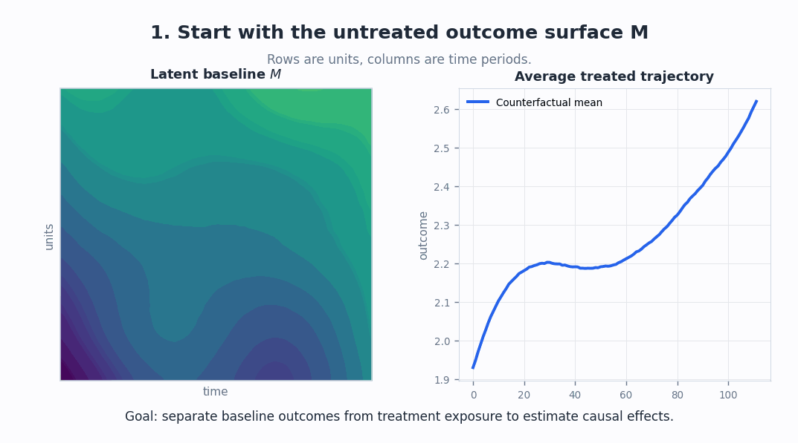
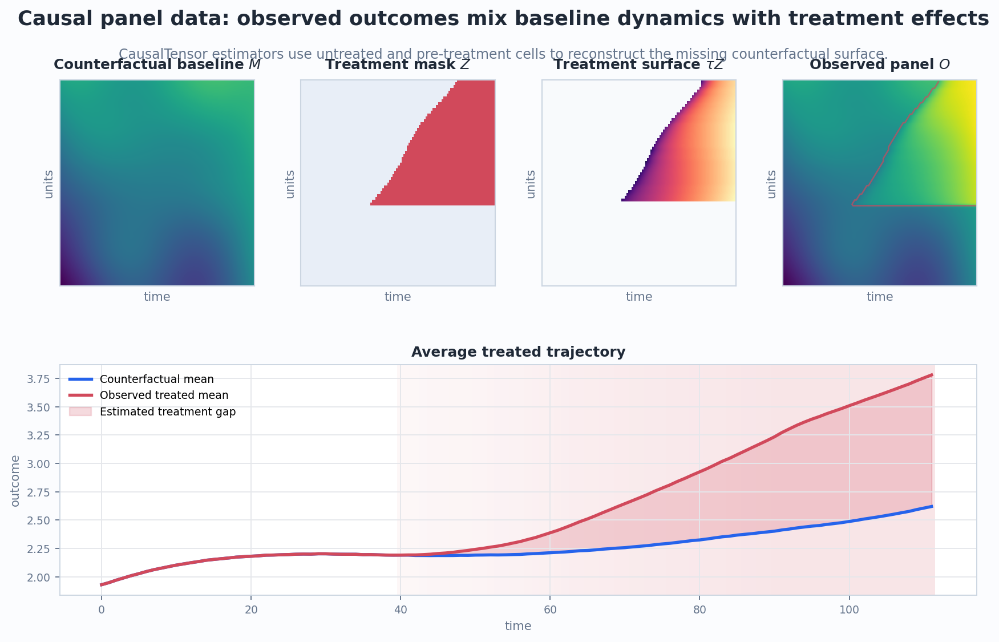

# CausalTensor

CausalTensor is a Python package for causal inference and policy evaluation with panel data. The package achieved 30K downloads by 2025-10.

## What is CausalTensor

CausalTensor helps answer questions like "What is the impact of strategy X on outcome Y?" when we observe many units repeatedly over time. These panel data problems appear in econometrics, operations research, business analytics, political science, healthcare, and other settings where randomized experiments are difficult but historical comparison units are available.

Please visit our [complete documentation](https://causaltensor.readthedocs.io/) for more information.

## The causal panel problem

In a panel, rows are units and columns are time periods. Some unit-time cells are untreated, while others are exposed to a policy, intervention, or product change. The core challenge is that once a cell is treated, we observe the treated outcome but not the untreated counterfactual outcome for that same unit and time.

  

One useful way to write the problem is:

$$
O_{it} = M_{it} + \tau_{it} Z_{it} + \varepsilon_{it},
$$

where:

- $O_{it}$ is the observed outcome for unit $i$ at time $t$.
- $M_{it}$ is the untreated potential outcome, or the baseline surface we would like to reconstruct.
- $Z_{it}$ indicates treatment exposure.
- $\tau_{it}$ is the treatment effect in treated cells.

Equivalently, in matrix form, `O = M + tau * Z + epsilon`. We observe `O` and `Z`; the hard part is separating the baseline dynamics `M` from the treatment effect `tau`, especially where `Z = 1`. CausalTensor estimators use untreated and pre-treatment cells to reconstruct the missing counterfactual surface and estimate:

$$
\hat{\tau}_{it} = O_{it} - \hat{M}_{it}, \quad \text{for treated cells } Z_{it}=1.
$$

  

This framing follows the [matrix-completion view of causal panel data](https://arxiv.org/abs/1710.10251) and also explains the intuition behind [synthetic control](http://www.jstor.org/stable/3132164) and [synthetic difference-in-differences](https://arxiv.org/abs/1812.09970): different estimators construct the missing counterfactual surface in different ways.

## Installing CausalTensor
CausalTensor is compatible with Python 3 or later and also depends on numpy. The simplest way to install CausalTensor and its dependencies is from PyPI with pip, Python's preferred package installer.

    $ pip install causaltensor

Note that CausalTensor is an active project and routinely publishes new releases. In order to upgrade CausalTensor to the latest version, use pip as follows.

    $ pip install -U causaltensor
    
## Using CausalTensor

CausalTensor implements traditional Difference-in-Differences as well as recent panel estimators such as Synthetic Difference-in-Differences, Matrix Completion with Nuclear Norm Minimization, and De-biased Convex Panel Regression.

| Estimator      | Reference |
| ----------- | ----------- |
| [Difference-in-Difference (DID)](https://en.wikipedia.org/wiki/Difference_in_differences) | [Implemented through two-way fixed effects regression.](http://web.mit.edu/insong/www/pdf/FEmatch-twoway.pdf)       |
| [De-biased Convex Panel Regression (DC-PR)](https://arxiv.org/abs/2106.02780) | Vivek Farias, Andrew Li, and Tianyi Peng. "Learning treatment effects in panels with general intervention patterns." Advances in Neural Information Processing Systems 34 (2021): 14001-14013. |
| [Synthetic Control (OLS SC)](http://www.jstor.org/stable/3132164)   | Abadie, Alberto, and Javier Gardeazabal. “The Economic Costs of Conflict: A Case Study of the Basque Country.” The American Economic Review 93, no. 1 (2003): 113–32. |
| [Synthetic Difference-in-Difference (SDID)](https://arxiv.org/pdf/1812.09970.pdf)   | Dmitry Arkhangelsky, Susan Athey, David A. Hirshberg, Guido W. Imbens, and Stefan Wager. "Synthetic difference-in-differences." American Economic Review 111, no. 12 (2021): 4088-4118. |
| [Matrix Completion with Nuclear Norm Minimization (MC-NNM)](https://arxiv.org/abs/1710.10251)| Susan Athey, Mohsen Bayati, Nikolay Doudchenko, Guido Imbens, and Khashayar Khosravi. "Matrix completion methods for causal panel data models." Journal of the American Statistical Association 116, no. 536 (2021): 1716-1730. |

Please visit our [documentation](https://causaltensor.readthedocs.io/) for the usage instructions. Or check the following simple demo as a tutorial:

- [Panel Data Example](https://colab.research.google.com/github/TianyiPeng/causaltensor/blob/main/tutorials/Panel_Data_Example.ipynb)
    - [Panel Data Example with old API](https://colab.research.google.com/github/TianyiPeng/causaltensor/blob/main/tutorials/Panel%20Data%20Example.ipynb)
- [Panel Data with Multiple Treatments](https://colab.research.google.com/github/TianyiPeng/causaltensor/blob/main/tutorials/Panel_Regression_with_Multiple_Interventions.ipynb)
- [MC-NNM with covariates and missing data](https://colab.research.google.com/github/TianyiPeng/causaltensor/blob/main/tests/MCNNM_test.ipynb)
